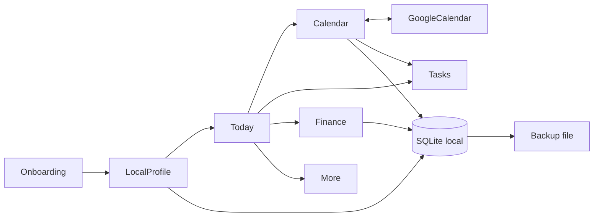

# Lumen — план идеи, стиля и каркаса

Рабочее имя: **Lumen**. Свет, ясность, жизнь как система. Не «ещё один трекер», а личный пульт: календарь и деньги живые сразу, остальные разделы стоят как комнаты и наполняются следом.

**Владелец / Developer:** Nanda · **Компания:** Cheterin Group  
Контакты: adnan.huseynli1@gmail.com · Telegram nanda070 · Discord nandak070 · [discord.gg/cheterin](https://discord.gg/cheterin) · GitHub nanda070  
Техническая правда: [TECHNICAL.md](TECHNICAL.md).

Аудитория: ты и близкие, без магазинов. Раздача: TestFlight / IPA, APK, Flutter Web (это скомпилированное приложение в браузере, не PWA).

Язык: **EN по умолчанию**, RU переключается в онбординге и в настройках.

---

## Характер продукта

Референсы не копируем один в один — берём *чувство*:

- **Календарь** — Notion Calendar: неделя как холст, «сейчас»-линия, быстрое создание, несколько календарей цветом.
- **Задачи** — Todoist: Inbox / Today / Upcoming, жесты, приоритет, из календаря — «планы на день».
- **Привычки** — Streaks: крупные кольца, серия, один тап.
- **Распорядок** — шаблон дня по слотам времени, не список дел.
- **Финансы** — Monarch: счета, категории, таблица операций, валюта, графики. Без банковских подключений (Plaid и аналоги для «себя и друзей» не тянем).
- **Питание / тренировки** — каркас. FatSecret и Strong/Hevy — следующий этап, когда каркас и два живых модуля уже «вау».

Главный экран **Today**: пульс дня — ближайшие события, задачи, полоска распорядка, расход за день, привычки. С телефона это должен быть экран, на который открываешь приложение.

---

## Онбординг → локальный профиль

Короткий intro на 4–5 экранов, не анкета:

1. Имя / ник
2. Язык (EN default) + страна
3. Базовая валюта (по стране, можно сменить)
4. Опционально Google Calendar
5. Готово — создаётся локальный профиль, пустые календари «Personal» / «Lumen», дефолтные категории денег

Без аккаунта Lumen, без сервера. Профиль = одна запись в локальной БД.

---

## Данные и бэкап

Источник правды — **локальный SQLite** (Drift). Один файл жизни.

Бэкап: экспорт `.lumen` (zip: sqlite + манифест версий) и скачивание / share sheet. Восстановление с заменой или merge — решим на реализации. Без облака Lumen.

Google — *связанный* календарь, не замена базы. Правишь в Lumen → Events API. Тянем изменения → incremental `syncToken`. Конфликты: last-write-wins + пометка «разойтись».

Нужен **твой Google Cloud проект** (OAuth, Calendar API, тестовые пользователи до 100). Без этого двусторонняя синхронизация не поедет.

---

## Модули: что живое, что комната

| Раздел | v1 | Суть |
|---|---|---|
| Оболочка, Today, профиль, EN/RU, тема | живое | каркас «вау» |
| Календарь | живое | день/неделя/месяц, цвета, создание/правка, ICS, Google two-way |
| Финансы | живое | счета, категории, операции-таблица, валюта, месяц, 2–3 графика |
| Tasks | комната | список + связь «события дня → планы» уже в модели |
| Habits / Routine | комната | экраны-заглушки в стиле, схема в БД |
| Nutrition / Training | комната | пустые, без FatSecret/Hevy-логики |

**Календарь v1:** виды Day / Week / Month, now-line, drag слота, несколько календарей, Google connect, локальные события без Google. Профессиональность = виды + sync + быстрый ввод, не «ещё 15 интеграций».

**Финансы v1:** как Monarch *по ощущению* (таблица, категории, валюта, обзор месяца), не инвестиции и не автоподтяжка банков.

**Tasks ↔ Calendar:** событие на сегодня может появиться в Today/Tasks как план. Задача с датой может опционально светиться в календаре. Распорядок — отдельные шаблоны слотов, не дубль задач.

---

## Стек

- Flutter, iOS-first, Android + Web тем же кодом
- Drift + SQLite, `easy_localization` или `slang` (EN/RU)
- `google_sign_in` + Calendar API
- Свой calendar canvas (не `table_calendar` как финальный UI)
- Motion: implicit + explicit springs, Impeller; стекло — backdrop blur там, где не убивает FPS
- Backup: `file_picker` / `share_plus` / `path_provider`

Web в v1 — тот же UI, Google OAuth через web client id. Если web-OAuth в первой итерации будет мешать iPhone — календарь на web остаётся локальным + ICS.

---

## Порядок работы

1. Дизайн-система Lumen: токены, типографика, компоненты (glass bar, число, карточка события, row транзакции).
2. Онбординг + профиль + навигация + пустые комнаты.
3. Календарь локальный до уровня «хочется пользоваться».
4. Финансы до уровня «хочется вести месяц».
5. Google two-way.
6. Бэкап скачать / восстановить.
7. Потом Tasks → Habits → Routine → Nutrition → Training.

См. также: [STYLE.md](STYLE.md), [TODOS.md](TODOS.md).
